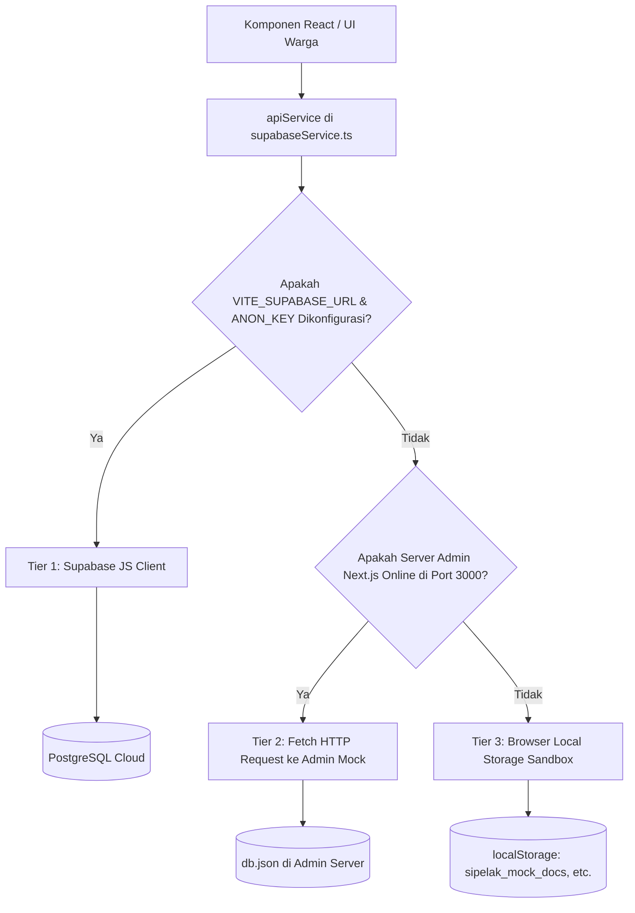

# 📱 DOKUMENTASI SIPELAK PORTAL WARGA (USER PORTAL)
## Aplikasi Frontend Pelayanan Mandiri Warga Kecamatan

Dokumen ini berisi panduan teknis mendalam mengenai **SIPELAK Portal Warga**—aplikasi frontend berbasis web yang dirancang khusus agar warga kecamatan dapat mengajukan berbagai dokumen kependudukan secara mandiri, melacak status permohonan, dan mengakses informasi penting dari kecamatan.

---

## 📋 Daftar Isi
1. [Ringkasan & Fitur Utama](#-ringkasan--fitur-utama)
2. [Stack Teknologi](#-stack-teknologi)
3. [Arsitektur Integrasi Data & 3-Tier Fallback](#-arsitektur-integrasi-data--3-tier-fallback)
4. [Struktur Direktori & Analisis Komponen](#-struktur-direktori--analisis-komponen)
5. [Alur Formulir Multi-Step (`FormPengajuan`)](#-alur-formulir-multi-step-formpengajuan)
6. [Sistem Pelacakan Dokumen (Tracking System)](#-sistem-pelacakan-dokumen-tracking-system)
7. [Panduan Instalasi & Setup Variabel `.env`](#-panduan-instalasi--setup-variabel-env)
8. [Desain Tampilan & Fitur Ramah Cetak (Print Style)](#-desain-tampilan--fitur-ramah-cetak-print-style)

---

## 🌟 Ringkasan & Fitur Utama

Portal Warga SIPELAK berfokus pada kemudahan akses, kesederhanaan pengisian data, dan transparansi status administrasi. Warga tidak perlu datang ke kantor kecamatan hanya untuk mengantre berkas atau sekadar menanyakan apakah dokumen mereka sudah selesai diproses.

### Fitur Utama:
* **Informasi Layanan Terintegrasi**: Panduan persyaratan lengkap untuk 8 jenis surat administrasi kecamatan.
* **Otentikasi & Manajemen Profil**: Penyimpanan data pribadi (NIK, Nama, Kontak, Alamat) secara aman untuk pengisian otomatis formulir berikutnya.
* **Formulir Pengajuan Surat Multi-Step**: Proses pengisian data pemohon secara bertahap dilengkapi dengan validasi input dan simulasi unggah berkas.
* **Resi Digital Ramah Cetak**: Bukti pengajuan yang berisi ringkasan data, waktu pengajuan, dan kode tracking unik (`SPLK-XXXXX`).
* **Sistem Lacak (Tracking)**:
  * **Lacak Tanpa Login (Widget Beranda)**: Lacak status secara langsung hanya dengan memasukkan kode tracking.
  * **Surat Saya (Panel User)**: Histori pengajuan lengkap, monitoring alasan penolakan, dan opsi cetak dokumen/resi.

---

## 🛠️ Stack Teknologi

Aplikasi frontend ini dibangun menggunakan teknologi web modern:
* **Framework Library**: [React v19](https://react.dev/) dengan [TypeScript](https://www.typescriptlang.org/) untuk kode yang terstruktur dan aman.
* **Build Tool**: [Vite v8](https://vite.dev/) untuk kompilasi cepat dan performa optimal.
* **Styling**: Vanilla CSS kustom ([`src/App.css`](file:///home/dimasarjuna/Documents/sipelak/user/src/App.css) & [`src/index.css`](file:///home/dimasarjuna/Documents/sipelak/user/src/index.css)) dengan arsitektur responsif seluler serta print-styling kustom.
* **Icons**: [Lucide React](https://lucide.dev/) untuk representasi ikon navigasi dan status.

---

## 💾 Arsitektur Integrasi Data & 3-Tier Fallback

Untuk menjaga aplikasi tetap berjalan dalam berbagai kondisi pengujian, berkas service [`src/lib/supabaseService.ts`](file:///home/dimasarjuna/Documents/sipelak/user/src/lib/supabaseService.ts) mengimplementasikan logika hibrida **3-Tier Fallback Engine**:



* **Tier 1 (Supabase)**: Mode produksi penuh. Pengguna didaftarkan secara resmi ke auth engine Supabase, dan data disimpan di database awan dengan pengamanan RLS.
* **Tier 2 (Admin Mock)**: Sinkronisasi instan dengan Admin Panel lokal. Pengajuan warga akan disimpan di server Next.js (`http://localhost:3000/api/mock/`) ke berkas database `db.json`, mempermudah demo pengajuan warga dan pemrosesan admin.
* **Tier 3 (Local Storage)**: Skenario offline total. Data disimpan secara lokal di browser komputer saat ini, sehingga aplikasi tetap interaktif walaupun server admin maupun internet mati.

---

## 📁 Struktur Direktori & Analisis Komponen

Struktur berkas kode sumber utama di dalam direktori [`src/`](file:///home/dimasarjuna/Documents/sipelak/user/src):

```bash
src/
├── components/          # Kumpulan Komponen Presentasional & Logika Halaman
│   ├── Alur.tsx         # Menampilkan tahapan pengurusan dokumen kependudukan
│   ├── Auth.tsx         # Halaman Registrasi & Login Warga (NIK, Email, Password)
│   ├── Berita.tsx       # Menampilkan pengumuman/berita terbaru kecamatan
│   ├── FAQ.tsx          # Akordeon tanya-jawab interaktif warga
│   ├── Footer.tsx       # Footer layout web warga
│   ├── FormPengajuan.tsx# Formulir pengajuan multi-step surat kependudukan
│   ├── Hero.tsx         # Jumbotron beranda dengan widget pencarian status dokumen
│   ├── Kontak.tsx       # Alamat, Peta Lokasi, WhatsApp, email, & info Camat
│   ├── Layanan.tsx      # Daftar 8 layanan utama kecamatan & persyaratannya
│   ├── Navbar.tsx       # Header navigasi & conditional logout/profil warga
│   ├── Statistik.tsx    # Informasi jumlah pengajuan sukses, diproses, & kepuasan
│   ├── SuratSaya.tsx    # Halaman histori & detail status pengajuan terotentikasi
│   └── TrackingModal.tsx# Overlay pratinjau histori & progres pelacakan berkas
├── lib/
│   └── supabaseService.ts # Engine pengelola integrasi Supabase, Mock API, & LocalStorage
├── App.css              # Seluruh layout styling, tema warna, & media cetak
├── App.tsx              # Root component & penanganan state navigasi utama
├── index.css            # Dasar-dasar styling, variabel CSS, & reset layout
└── main.tsx             # Rendering entry point React
```

---

## 📝 Alur Formulir Multi-Step (`FormPengajuan`)

Komponen [`FormPengajuan.tsx`](file:///home/dimasarjuna/Documents/sipelak/user/src/components/FormPengajuan.tsx) mengoordinasikan input data pengajuan melalui empat tahap (*Steps*) terstruktur:

1. **Langkah 1: Pilih Layanan**
   * Pengguna memilih salah satu dari 8 tipe layanan (KTP, KK, KIA, SKP, SKTM, SKU, Pengantar Nikah, Pengantar SKCK).
   * Box persyaratan dokumen tampil secara otomatis sesuai dengan layanan yang dipilih.
2. **Langkah 2: Data Pemohon**
   * Pengisian biodata lengkap warga:
     * **NIK** (16 digit angka wajib).
     * **Nama Lengkap** & **Nomor Telepon**.
     * **Alamat Lengkap** (dilengkapi pilihan RT dan RW).
   * Input data otomatis diisi jika warga terdaftar telah login dan menyimpan profil.
3. **Langkah 3: Unggah Berkas**
   * Pengguna mengunggah scan/foto berkas persyaratan yang diminta.
   * Mendukung antarmuka drag-and-drop file.
   * Dilengkapi validasi jenis file (JPG, PNG, PDF) dan batas ukuran file (maksimal 5MB).
4. **Langkah 4: Selesai / Tanda Terima Resi**
   * Menampilkan tanda terima digital lengkap dengan tanggal pengajuan dan **Kode Lacak Unik** (`SPLK-XXXXX`).
   * Menyediakan instruksi pengambilan berkas fisik asli ke kantor kecamatan.
   * Menyediakan tombol cetak resi/bukti tanda terima.

---

## 🔍 Sistem Pelacakan Dokumen (Tracking System)

Sistem pelacakan dokumen dibagi menjadi dua fungsionalitas utama:

### 1. Pelacakan Publik (Anonim)
* Dilakukan langsung melalui search bar di bagian **Hero** beranda utama.
* Warga memasukkan kode pengajuan (misalnya: `SPLK-98234`).
* Sistem memicu modal [`TrackingModal.tsx`](file:///home/dimasarjuna/Documents/sipelak/user/src/components/TrackingModal.tsx).
* Data ditarik baik dari memory cache lokal maupun query backend Supabase untuk dicocokkan. Status pelacakan yang ditunjukkan meliputi:
  * 🟡 **Verifikasi Berkas**: Berkas baru masuk dan sedang ditinjau kelengkapannya.
  * 🔵 **Sedang Diproses**: Berkas lengkap, sedang antre proses cetak/TTE Camat.
  * 🟢 **Siap Diambil**: Dokumen fisik telah terbit dan siap diambil warga di loket.
  * 🔴 **Ditolak**: Pengajuan gagal diproses karena berkas tidak memenuhi syarat (disertai alasan detail penolakan).

### 2. Pelacakan Terpusat (Surat Saya)
* Warga yang telah login dapat mengakses tab **Surat Saya** di navbar.
* Menampilkan daftar semua pengajuan yang pernah diajukan oleh pengguna saat ini.
* Menampilkan ringkasan status berkas secara *real-time*.
* Menyediakan fitur **Pratinjau Draf Surat** / **Unduh Berkas Digital** jika dokumen telah disetujui dan siap diambil.

---

## 🚀 Panduan Instalasi & Setup Variabel `.env`

Ikuti instruksi berikut untuk menjalankan Portal Warga di komputer lokal Anda:

### 1. Jalankan Aplikasi
1. Buka folder `user` di terminal:
   ```bash
   cd user
   ```
2. Pasang paket dependencies:
   ```bash
   npm install
   ```
3. Jalankan development server:
   ```bash
   npm run dev
   ```
4. Buka browser Anda di: **`http://localhost:5173`**.

---

### 2. Menghubungkan ke Supabase (Production Mode)
Secara default, portal berjalan dalam mode demo dengan local-storage/admin-mock. Untuk menghubungkannya ke database Supabase cloud asli:
1. Buat berkas baru bernama **`.env`** di dalam root folder `user/`.
2. Masukkan URL proyek dan Anon Key dari dashboard Supabase Anda:
   ```env
   VITE_SUPABASE_URL=https://proyek-anda.supabase.co
   VITE_SUPABASE_ANON_KEY=eyJhbGciOiJIUzI1NiIsInR5cCI6IkpXVCJ9.eyJpc3MiOiJzdXBhYmFzZSIsInJlZiI6InByb3lla2UtYW5kYSIs...
   ```
3. Jalankan ulang server (`npm run dev`). Aplikasi akan mendeteksi env tersebut dan beralih ke database awan secara otomatis.

---

## 🖨️ Desain Tampilan & Fitur Ramah Cetak (Print Style)

Aplikasi Portal Warga SIPELAK dilengkapi dengan integrasi print-stylesheet di dalam berkas [`src/App.css`](file:///home/dimasarjuna/Documents/sipelak/user/src/App.css).

Guna mendukung kelancaran administrasi fisik, aturan CSS `@media print` diterapkan untuk mengoptimalkan dokumen cetak:
* **Penyembunyian Layout Tidak Penting**: Elemen Navbar, Footer, Button, Banner, dan formulir input otomatis disembunyikan (`display: none !important`) saat proses cetak dipicu.
* **Margin & Kontainer Khusus**: Halaman resi atau tanda terima pengajuan diposisikan di tengah kertas dengan border garis putus-putus (*dashed line*) khas resi tanda terima cetak.
* **Warna Khusus Printer**: Font teks diatur menjadi hitam pekat, latar belakang diubah menjadi putih bersih untuk menghemat tinta pencetakan printer warga.
